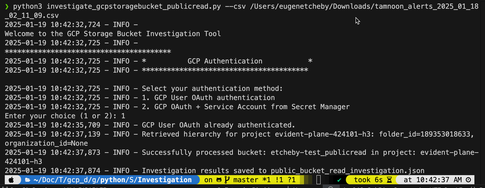
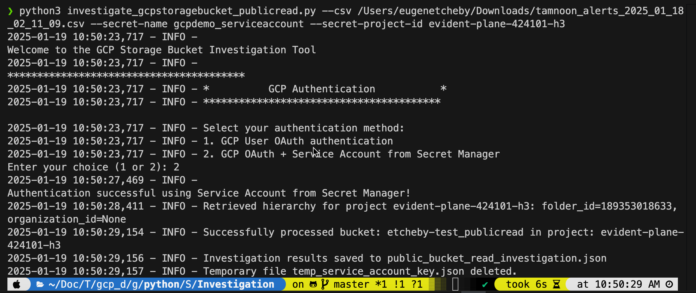
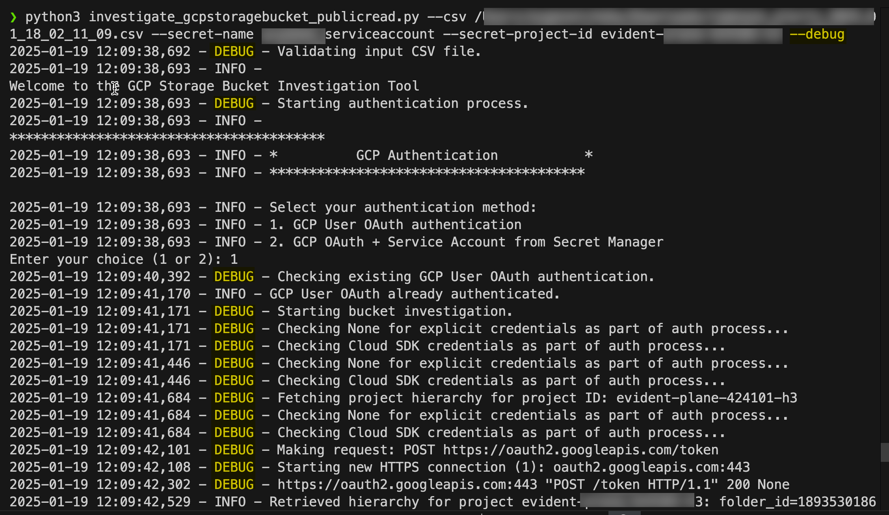
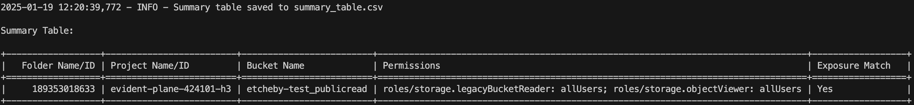

# GCP Storage Bucket(s): Anonymous Public Read - Investigation Tool


## Overview
The **GCP Storage Bucket(s): Anonymous Public Read - Investigation Tool** is a Python script designed to identify GCP storage buckets that have overly permissive IAM bindings allowing public/anonymous read access. It provides a detailed investigation of storage buckets across multiple GCP projects and outputs the results in both JSON and CSV formats, along with a terminal-displayed summary table.

## Features
- **GCP Authentication Options**:
  - GCP User OAuth authentication (using `gcloud` CLI).
  - Service Account JSON key retrieval from Google Secret Manager, with the ability to specify secret name and project ID via command-line arguments.
- **Script Flow**:
  - Parses `Cloud Account ID (Project ID)` & `Cloud Asset Name (Storage Bucket Name)` column values from Tamnoon Alerts CSV export.
  - Queries GCP storage buckets to retrieve metadata and IAM policies.
  - Identifies overly permissive IAM bindings (`roles/storage.objectViewer`, `roles/storage.legacyBucketReader`, etc.) granting access to `allUsers` or `allAuthenticatedUsers`.
  - Includes additional project-level details like folder and organization hierarchy.
  - Outputs findings in both JSON and CSV formats, with a human-readable summary table displayed in the terminal.
  - Securely manages temporary files for Service Account JSON keys.
  - Offers a `--debug` mode for detailed logging during execution.

## Prerequisites
1. **Python Environment**: Ensure Python 3.7 or higher is installed.
2. **Dependencies**: Install required Python libraries using the provided `requirements.txt` file:
   ```bash
   pip3 install -r requirements.txt
   ```
3. **gcloud CLI**: Install and configure the Google Cloud SDK (`gcloud`) for OAuth authentication.
4. **Service Account**: For authentication via Secret Manager, ensure a Service Account with the necessary permissions is created and stored in Secret Manager.

## Permissions Required

### Authentication Methods
#### Option 1: GCP User OAuth Authentication
- Requires the user to be authenticated via the `gcloud` CLI.
- The user must have the following permissions:
  - `storage.buckets.get`
  - `storage.buckets.getIamPolicy`
  - `resourcemanager.projects.get`

#### Option 2: Service Account from Secret Manager
- The Service Account must have:
  - `storage.buckets.get`
  - `storage.buckets.getIamPolicy`
  - `resourcemanager.projects.get`
- The GCP user executing the script must also have permissions to access the secret in Secret Manager:
  - `secretmanager.secrets.access`
  - `secretmanager.versions.access`
  - `secretmanager.secrets.get`

### Additional Features
- **Project Hierarchy Retrieval**: Queries the GCP organizational hierarchy to include folder and organization details for each project. This requires the following permissions: `resourcemanager.folders.get` and `resourcemanager.organizations.get`. These permissions ensure the script can fetch hierarchical details like folder and organization IDs.
- **Bucket Scanning**: The script lists buckets in each project specified in the input CSV file.
- **Policy Analysis**: Examines IAM bindings to detect public read access permissions.
- **Error Handling**: Logs errors related to permission issues or invalid configurations.

## Input
- **CSV File**: CSV export from Tamnoon's Alerts with `Cloud Account ID (Project ID)` & `Cloud Asset Name (Storage Bucket Name)` columns for the script to investigate.

## Output
- **JSON Report**: The script generates a JSON file (`public_bucket_read_investigation.json`) containing the following details:
  - **Project Details**:
    - `project_id`: The GCP project ID.
    - `folder_id`: The GCP folder ID, if applicable.
    - `organization_id`: The GCP organization ID, if applicable.
  - **Bucket Details**:
    - `bucket_name`: Name of the storage bucket.
    - `metadata`: Key storage bucket attributes, including:
      - `kind`, `selfLink`, `storageClass`, `uniformBucketLevelAccess`, `publicAccessPrevention`, `locationType`.
    - `iam_policy`: IAM bindings granting public access to `allUsers` or `allAuthenticatedUsers`.
    - `error` (if any): Describes permission or access issues.
- **CSV Summary Table**: The script generates a CSV file (`summary_table.csv`) summarizing findings:
  - **Columns**:
    - Folder Name/ID
    - Project Name/ID
    - Bucket Name
    - Permissions
    - Exposure Match

Note: **Exposure Match** column indicates whether the IAM permissions observed in the bucket’s metadata match the public exposure issues flagged in the input CSV file from CNAAP Alerts. It serves as a validation to confirm if the reported issue(s) align with the current IAM policy configuration.

Possible Values:
	1.	Yes:
	•	Indicates that the IAM bindings granting public access (allUsers or allAuthenticatedUsers) match the issues reported in the input CSV.
	2.	No:
	•	Indicates no IAM bindings granting public access (allUsers or allAuthenticatedUsers) were found for the bucket.
	3.	Discrepancy:
	•	Indicates a mismatch between the reported issues in the input CSV and the IAM policy fetched from the bucket’s metadata.
	•	For example, public exposure may be flagged in the CSV, but the current IAM policy shows no such permissions.


- **Terminal Summary Table**: Displays a human-readable summary table of findings.

## How to Run
1. Clone the repository and navigate to the script directory.
2. Prepare Tamnoon's Alerts input CSV file with `Cloud Account ID (Project ID)` and `Cloud Asset Name (Storage Bucket Name)` columns.
3. Run the script with one of the following options:

   - **Option 1**: Authenticate using `gcloud` CLI:

     ```bash
     python3 investigate_gcpstoragebucket_publicread.py --csv /path/to/csv_file.csv
     ```
   

   - **Option 2**: Authenticate using a Service Account JSON key retrieved from Secret Manager:

     ```bash
     python3 investigate_gcpstoragebucket_publicread.py --csv /path/to/csv_file.csv --secret-name my-secret --secret-project-id my-project-id
     ```
   

4. Use the `--debug` flag for verbose logging during execution:
   ```bash
   python3 investigate_gcpstoragebucket_publicread.py --csv /path/to/csv_file.csv --debug
   ```
    

5. Follow the prompts for any additional input if required.
6. The results will be saved to `public_bucket_read_investigation.json` and `summary_table.csv`.

## Example JSON Output
```json
{
  "project-1": {
    "folder_id": "1234567890",
    "organization_id": "9876543210",
    "buckets": [
      {
        "bucket_name": "example-bucket-1",
        "metadata": {
          "kind": "storage#bucket",
          "selfLink": "https://www.googleapis.com/storage/v1/b/example-bucket-1",
          "storageClass": "STANDARD",
          "uniformBucketLevelAccess": true,
          "publicAccessPrevention": "enforced",
          "locationType": "multi-region"
        },
        "iam_policy": {
          "bindings": [
            {
              "role": "roles/storage.objectViewer",
              "members": ["allUsers"]
            }
          ]
        }
      }
    ]
  }
}
```

## Example summary_table.csv Output


## Security Considerations
- **Temporary Files**: The script securely handles temporary files for Service Account JSON keys and deletes them immediately after use.
- **Access Control**: Ensure the executing user or Service Account has only the necessary permissions to minimize security risks.

## Troubleshooting
1. **Error: Access Denied**
   - Verify that the user or Service Account has the required permissions.
2. **Error: Secret Manager Access Denied**
   - Ensure the user has `secretmanager.secrets.access`, `secretmanager.versions.access`, and `secretmanager.secrets.get` permissions.
3. **OAuth Authentication Issues**
   - Run `gcloud auth application-default login` manually to reauthenticate.

