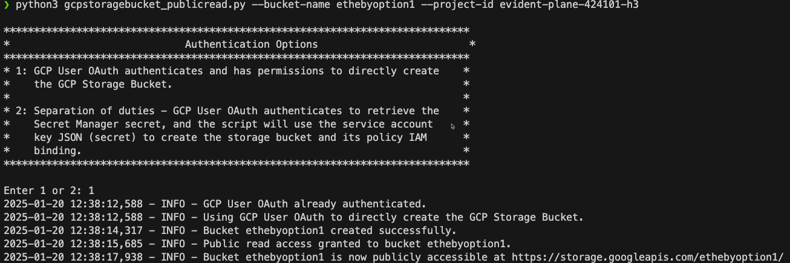
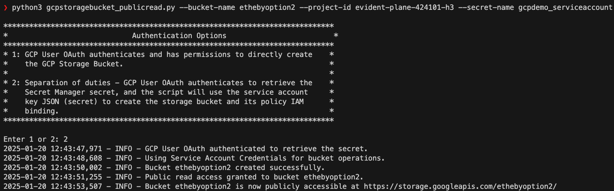
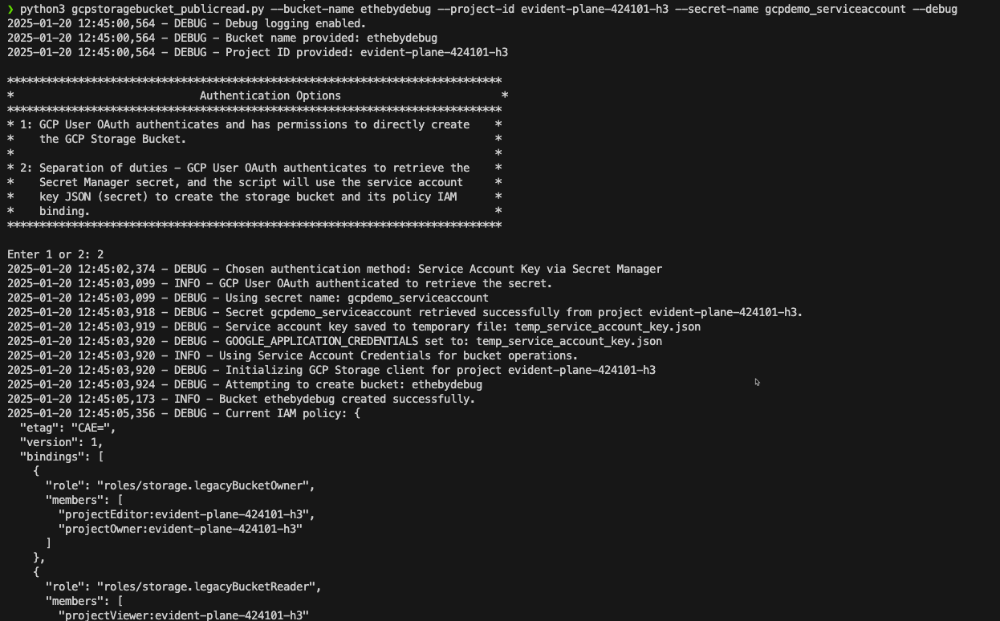

# GCP Storage Bucket - Public Read Anonymous Access - Script


## Overview

This script automates the creation of Google Cloud Platform (GCP) storage buckets with public read access. It offers robust logging, detailed debugging, and seamless handling of authentication options. The script aligns with cloud-native security principles, helping mitigate issues related to publicly exposed buckets.

### Key Features

- Supports two authentication methods:
  - GCP User OAuth
  - Service Account Key retrieved from Secret Manager
- Configurable via command-line arguments (`--bucket-name`, `--project-id`, `--secret-name`, and `--debug`).
- Detailed debug logs and error handling for common GCP-related exceptions.
- Aligns with CNAPP framework mappings, specifically targeting Wiz Issue `wc-id-29` (Publicly exposed bucket (allows read access to all users).

---

## What the Script Does

This script:

1. Authenticates with GCP using OAuth or a Service Account Key.

2. Creates a GCP storage bucket with the specified name in the given project.

3. Sets public read access to the bucket by explicitly granting the following permission:

   ```json
   {
     "role": "roles/storage.objectViewer",
     "members": [
       "allUsers"
     ]
   }
   ```

   This grants the `roles/storage.objectViewer` role to everyone on the internet (`allUsers`), making all read requests anonymous.

   > **Note:** According to GCP documentation, public access also applies to anyone signed into a Google account (`allAuthenticatedUsers`) if they are listed as a member on the bucket role IAM binding. Refer to the [official documentation](https://cloud.google.com/storage/docs/cloud-console?_gl=1*10s4kvs*_ga*OTU0ODMwNDA1LjE3MzU1NzU5MDE.*_ga_WH2QY8WWF5*MTczNzE3MDA2Ni4yOC4xLjE3MzcxNzI0NTIuNTAuMC4w#_sharingdata) for more details.

4. Provides a public URL for easy access to the bucket.

The script addresses the `Publicly Exposed Bucket` issue (Wiz Graph Control ID: `wc-id-29`) by explicitly granting read access only when configured.

---

## How to Run the Script

### Prerequisites

- Install the following Python libraries:
  ```bash
  pip3 install -r requirements.txt```
- Ensure `gcloud` CLI is installed and configured.
- Python 3.7 or higher.
- Necessary GCP IAM permissions (refer to [Custom IAM Role](#custom-iam-role)).

### Authentication Options

#### Option 1: GCP User OAuth Authentication

1. Select `Option 1` when prompted.
2. The script uses your existing GCP User OAuth credentials to authenticate and perform bucket operations.
3. Example command:
   ```bash
   python3 gcpstoragebucket_publicread.py --bucket-name <bucket-name> --project-id <project-id> --debug
   ```



#### Option 2: Service Account Key via Secret Manager

1. Select `Option 2` when prompted.
2. The script retrieves the service account key from GCP Secret Manager.
3. Set the `--secret-name` argument to specify the secret containing the key.
4. Example command:
   ```bash
   python3 gcpstoragebucket_publicread.py --bucket-name <bucket-name> --project-id <project-id> --secret-name <secret-name>
   ```


---

## Command-Line Help Menu

Run the script with the `--help` flag to view all available options:

```bash
python3 gcpstoragebucket_publicread.py --help
```

Example output:

```plaintext
usage: gcpstoragebucket_publicread.py [-h] [--bucket-name BUCKET_NAME]
                                      [--project-id PROJECT_ID]
                                      [--secret-name SECRET_NAME]
                                      [--debug]

Create a GCP Storage bucket with public access.

optional arguments:
  -h, --help            Show this help message and exit
  --bucket-name BUCKET_NAME
                        Name of the GCP Storage bucket to create.
  --project-id PROJECT_ID
                        GCP project ID where the bucket will be created.
  --secret-name SECRET_NAME
                        Name of the Secret Manager secret containing service
                        account key.
  --debug               Enable debug logging.
```


---

## Custom IAM Role

To minimize permissions while ensuring the script functions as intended, create a custom IAM role with the following permissions:

### Required Permissions

#### For Bucket Operations

- `storage.buckets.create`
- `storage.buckets.get`
- `storage.buckets.setIamPolicy`
- `storage.objects.create`
- `storage.objects.get`
- `storage.objects.list`

#### For Secret Manager Access (if using Option 2)

- `secretmanager.secrets.get`
- `secretmanager.versions.access`

### Example Custom Role Creation

1. Save the following JSON to a file (e.g., `custom_role.json`):
   ```json
   {
       "title": "CustomBucketCreatorRole",
       "description": "Custom role for creating and managing GCP storage buckets.",
       "stage": "GA",
       "includedPermissions": [
           "storage.buckets.create",
           "storage.buckets.get",
           "storage.buckets.setIamPolicy",
           "storage.objects.create",
           "storage.objects.get",
           "storage.objects.list",
           "secretmanager.secrets.get",
           "secretmanager.versions.access"
       ]
   }
   ```
2. Create the role using `gcloud`:
   ```bash
   gcloud iam roles create CustomBucketCreatorRole --project=<project-id> --file=custom_role.json
   ```

---

## Debug Logging

Enable debug mode using the `--debug` flag to see detailed logs for each operation. Example:

```bash
python3 gcpstoragebucket_publicread.py --bucket-name <bucket-name> --project-id <project-id> --debug
```

---

## Troubleshooting

- **Bucket Already Exists**: Ensure the bucket name is globally unique.
- **403 Permission Denied**: Verify that your account has the necessary IAM roles.
- **gcloud Not Installed**: Install the [Google Cloud SDK](https://cloud.google.com/sdk/docs/install).

---

## Contributing

Contributions and feedback are welcome! Submit a pull request or open an issue to improve the script.

---
